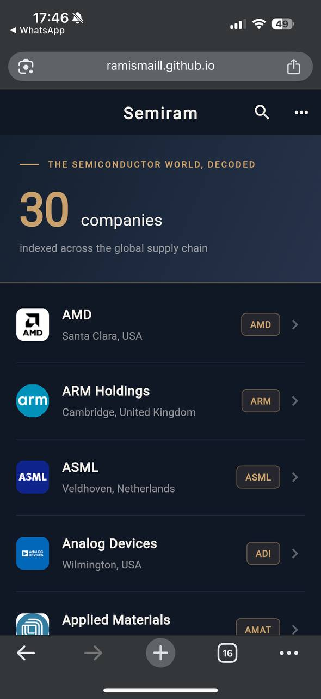
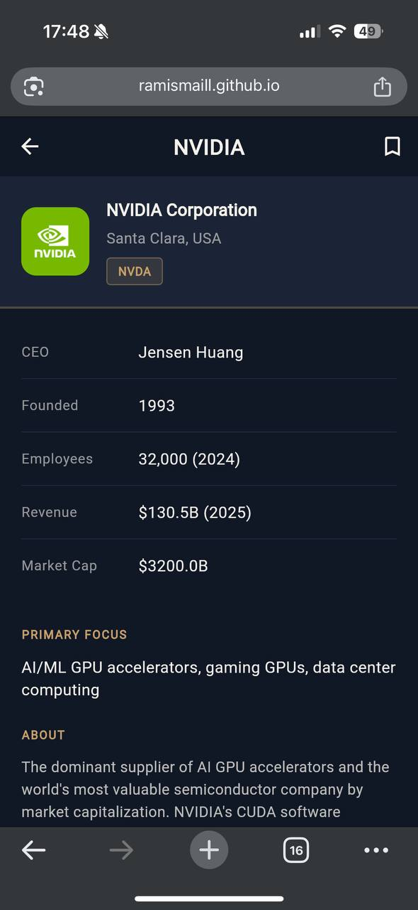
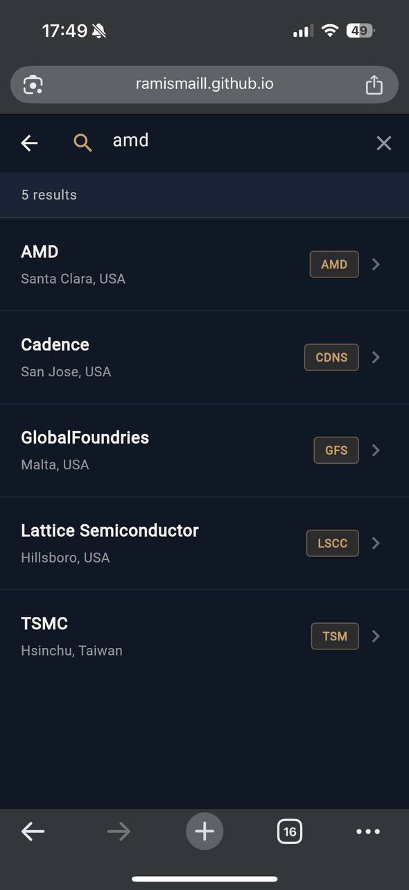
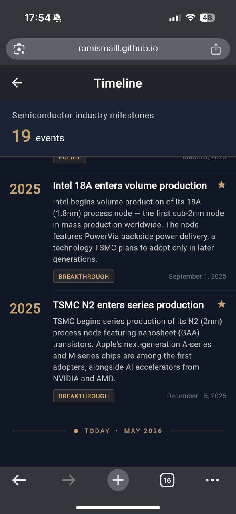
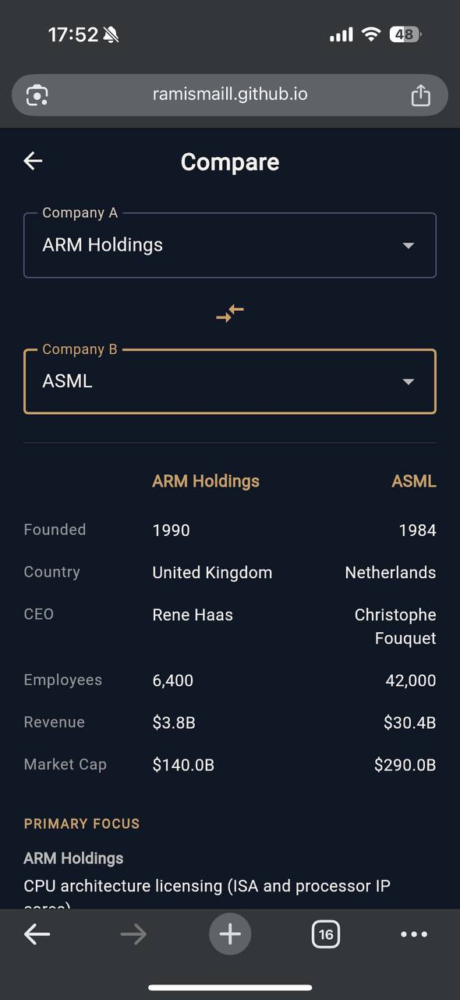
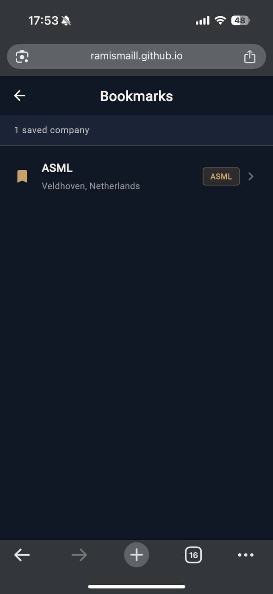

# Semiram


> *The semiconductor world, decoded.*

**Semiram** is an offline-first app and open reference for the semiconductor industry — the companies that make it, the technology behind it, and the history that shaped it. It exists to make an industry most people never think about (but that quietly runs the modern world) understandable to anyone curious enough to look.

It covers **30 companies** across the full supply chain — fabs, equipment makers, IP licensors, EDA tools — and **19 milestones** from the invention of the transistor in 1947 to TSMC's 2nm node in 2025.

This started as a student project. It isn't anymore — it's an ongoing effort to build the clearest, most accessible map of the semiconductor world available anywhere, and it will keep growing: more companies, deeper history, live market data, and eventually a place where anyone — students, engineers, investors, or the just-curious — can actually understand how a chip gets from sand to your pocket.

---

## 🌐 Live Demo

Try Semiram in your browser:
**[https://ramismaill.github.io/Semiram/](https://ramismaill.github.io/Semiram/)**

📹 **Video Walkthrough:** [YouTube](https://youtu.be/m2DDahdYed0) *(recorded on an earlier version — UI has since been updated)*

---

## 📸 Screenshots

<p float="left">
  
  
  
  
  
  
</p>

---

## ✨ Features

### Core
- **30 semiconductor companies** – full profiles: CEO, revenue, market cap, key technologies, notable customers
- **19 historical milestones** – from 1947 to 2025, categorized and chronologically ordered
- **Relevance‑ranked search** – across 6 fields (exact match → prefix → ecosystem)
- **Side‑by‑side comparison** – compare any two companies head to head
- **Polymorphic bookmarks** – save companies, events, and (future) roles
- **Offline‑first** – no internet required for core features

### v2.0
- **Real company logos** – high‑resolution local assets with network fallback
- **Full web support** – SQLite runs in the browser via WebAssembly + IndexedDB
- **Light/Dark theme toggle** – persisted across sessions
- **Expanded coverage** – from 20 to 30 companies, adding Europe, Japan, and equipment makers

---

## 🗺️ Where This Is Going

Semiram is version 2 of a project meant to outgrow its origins. Planned direction:

Semiram is growing into a **learning platform for the semiconductor world** — think of what W3Schools did for web development or Duolingo for languages, applied to the chip industry. It is deliberately **not** a financial data tool: no live stock tickers, no market tracking — that scope belongs to Yahoo Finance and friends. Semiram teaches how the industry works:

- Structured learning paths for people with zero background — how a chip is designed, manufactured, and shipped
- Expanding well past 30 companies toward comprehensive coverage of the global supply chain
- Deeper historical content — not just milestones, but the *why* behind each one
- Interactive explanations of core concepts: lithography, process nodes, fabless vs. foundry, EDA, packaging

If you're interested in contributing, following along, or have ideas — reach out (see below).

---

## 🛠️ Tech Stack

| Component | Technology |
|-----------|------------|
| **Language** | Dart 3.11.4 |
| **Framework** | Flutter 3.41.6 |
| **Database** | SQLite via `sqflite` (mobile) + `sqflite_common_ffi_web` (web/WASM) |
| **State** | SetState + FutureBuilder |
| **Theme** | `shared_preferences` for persistent Dark/Light mode |
| **Assets** | High-res local logo assets with network fallback |
| **Utilities** | `intl`, `path_provider`, `url_launcher` |

---

## 🏛️ Architecture

The project follows the **Repository Pattern** for strict separation of concerns:

```
lib/
├── core/
│   ├── database/       → DatabaseHelper, SeedLoader, Schema
│   ├── models/         → Company, IndustryEvent
│   ├── repositories/   → CompaniesRepository, EventsRepository, BookmarksRepository
│   └── theme/          → AppTheme (Light/Dark definitions)
├── features/
│   ├── home/           → HomeScreen (list + hero banner)
│   ├── companies/      → CompanyDetailScreen
│   ├── search/         → SearchScreen (relevance-ranked)
│   ├── compare/        → CompareScreen (side-by-side)
│   ├── bookmarks/      → BookmarksScreen (polymorphic)
│   └── timeline/       → TimelineScreen (19 events)
├── shared/
│   └── widgets/        → CompanyLogo (local → network → letter fallback)
└── main.dart
```

- **SQL queries** live only in `repositories/`
- **Data models** live only in `models/`
- **UI logic** lives only in `features/`

---

## 🗄️ Database Schema

**8 tables, 18 indexes:**

| Table | Purpose |
|-------|---------|
| `companies` | 30 semiconductor companies (v3 schema with `domain`) |
| `industry_events` | 19 historical milestones |
| `bookmarks` | Polymorphic bookmarks (CHECK-constrained) |
| `products` | Products per company (1:N) |
| `technology_nodes` | Process nodes timeline |
| `company_node_history` | M2M: companies ↔ nodes |
| `careers_roles` | Engineering roles |
| `company_careers` | M2M: companies ↔ roles |

**Polymorphic Bookmarks Design:**
```sql
CREATE TABLE bookmarks (
  id INTEGER PRIMARY KEY AUTOINCREMENT,
  entity_type TEXT NOT NULL CHECK(entity_type IN ('company','event','role')),
  entity_id INTEGER NOT NULL,
  note TEXT,
  created_at TEXT NOT NULL,
  UNIQUE (entity_type, entity_id)
);
```

**Schema Versioning:**
- `v1`: Initial schema (20 companies)
- `v2`: Added `domain` column for logos
- `v3`: Added 10 new companies (NXP, Infineon, ST, AMAT, Lam, KLA, TEL, Renesas, onsemi, UMC)

---

## 🔍 Search Implementation

Relevance‑ranked search across 6 columns with `LIKE` matching:

```sql
SELECT * FROM companies
WHERE common_name LIKE ? OR official_name LIKE ?
   OR primary_focus LIKE ? OR short_description LIKE ?
   OR key_technologies LIKE ? OR notable_customers LIKE ?
ORDER BY
  CASE
    WHEN common_name = ?    THEN 1   -- exact match
    WHEN common_name LIKE ? THEN 2   -- prefix match
    ELSE 3                           -- ecosystem matches
  END,
  common_name COLLATE NOCASE ASC
```

**Example:** Searching "tsmc" returns TSMC first, followed by ecosystem companies (ASML, Cadence, Synopsys) that mention TSMC.

---

## 🛡️ Error Handling

Four layers of error control:

1. **`try/catch`** – optimistic UI rollback on bookmark toggles
2. **`FutureBuilder`** – error state with custom `ErrorView` widget
3. **`ArgumentError`** – prevents comparing a company to itself
4. **SQL `CHECK` & `UNIQUE`** – database‑level integrity

---

## 🚀 Getting Started

### Prerequisites
- Flutter SDK 3.41.6+
- Dart 3.11.4+
- Android SDK, Xcode, or Chrome (for web)

### Run Locally

```bash
git clone https://github.com/Ramismaill/Semiram.git
cd Semiram
flutter pub get
flutter run            # Android/iOS
flutter run -d chrome  # Web
```

### Build for Web

```bash
flutter build web --release --base-href /Semiram/
# output in build/web
```

### Download Logos (Optional)

```bash
powershell -ExecutionPolicy Bypass -File tools\download_logos.ps1 -Token YOUR_LOGO_DEV_KEY
```

---

## 📄 License

Semiram's source code is licensed under the [PolyForm Noncommercial License 1.0.0](LICENSE).

**In plain words:** you're free to use, study, and modify this code for personal, educational, and noncommercial purposes — but you must keep the copyright notice crediting Ram Ismail as the original author, and **any commercial use (selling, monetizing, or building commercial products on it) requires prior written permission** from the copyright holder. For commercial licensing inquiries, contact me via GitHub or LinkedIn (links below).

Company information (revenue, leadership, market cap, etc.) is drawn from publicly available sources — company earnings releases, SEC filings, and public market-cap data — and was last refreshed in **July 2026**. It is provided for educational and informational purposes only. Semiram is an independent project and is **not affiliated with, endorsed by, or sponsored by** any of the companies referenced.

---

## 👤 Author

**Ram Ismail** – [GitHub](https://github.com/Ramismaill) | [LinkedIn](https://www.linkedin.com/in/ram-ismail-060333266/)

Built with Flutter — 2026
